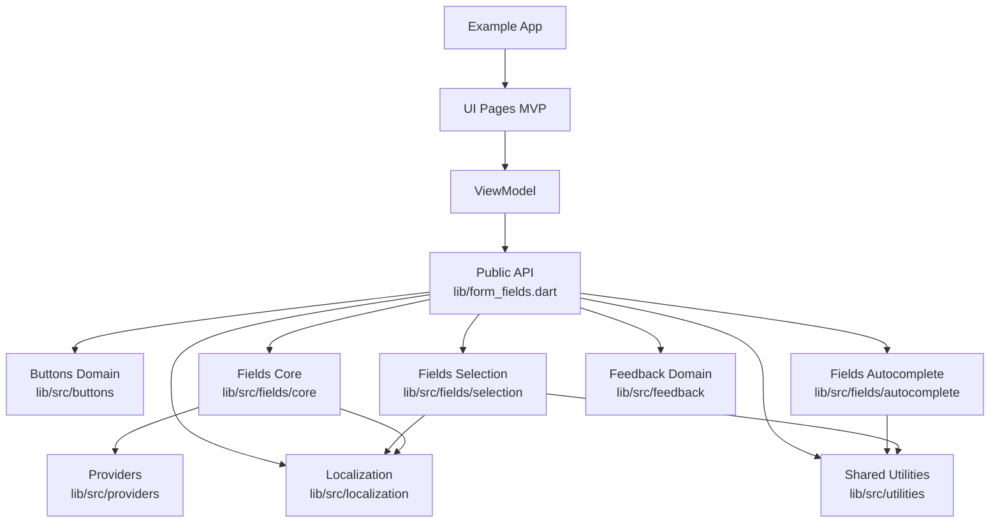
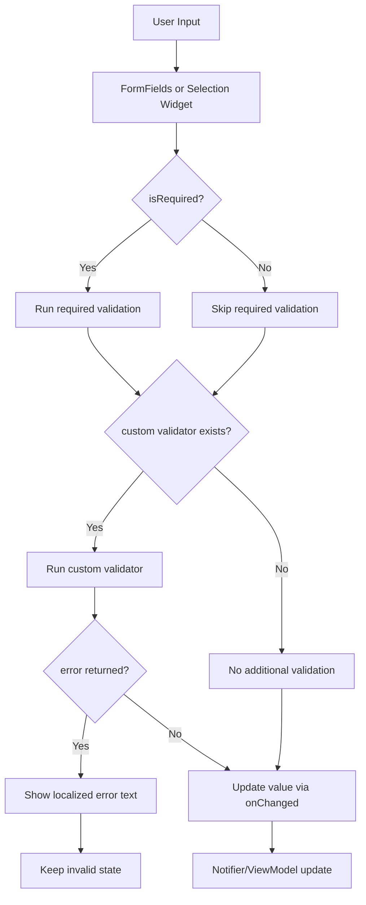
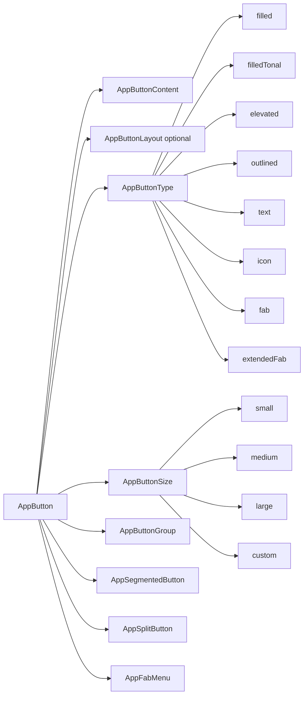

# Architecture Guide

## Overview

This project follows **Model-View-Presenter (MVP)** architecture combined with **Clean Architecture** principles for scalability, testability, and maintainability.

## Architecture Diagram



## FormFields Validation Flow



## AppButton Family Diagram



## Core Principles

### 1. Separation of Concerns

- **Presentation**: UI rendering and user interactions
- **Business Logic**: State management, validation, data processing
- **Data**: API calls, local storage, models

### 2. Dependency Injection

- Use Provider for global state
- Pass ViewModels to Views through PresenterState
- Avoid direct dependencies between layers

### 3. Single Responsibility

- Each file has one primary responsibility
- Each class focuses on a specific domain
- Each method does one thing well

## Package Source Layout

Library source in [lib/src](lib/src) is organized by feature domain:

- [lib/src/buttons](lib/src/buttons): AppButton family components and enums.
- [lib/src/fields/core](lib/src/fields/core): Main FormFields widget.
- [lib/src/fields/autocomplete](lib/src/fields/autocomplete): autocomplete field widget.
- [lib/src/fields/selection](lib/src/fields/selection): dropdown, multi-select, radio, checkbox, and selection wrapper.
- [lib/src/feedback](lib/src/feedback): app dialog service, loading indicators, and progress indicators.
- [lib/src/utilities](lib/src/utilities): shared enums, validators, extensions, and helpers.
- [lib/src/providers](lib/src/providers): internal notifiers.
- [lib/src/localization](lib/src/localization): package localization delegate and language maps.

Public API remains centralized via [lib/form_fields.dart](lib/form_fields.dart), so folder refactors do not impact package consumers.

## MVP Pattern Implementation

### Structure

Every screen/component consists of 4 files:

```
feature/
├── main.dart           # Exports and composition
├── presenter.dart      # StatefulWidget + PresenterState
├── view.dart          # Concrete State implementation
└── view_model.dart    # Business logic
```

### Example: LoginPage

**presenter.dart**

```dart
class LoginPage extends StatefulWidget {
  const LoginPage({super.key});

  @override
  State<LoginPage> createState() => View();
}

abstract class PresenterState extends State<LoginPage> {
  late final LoginViewModel viewModel;

  @override
  void initState() {
    super.initState();
    viewModel = LoginViewModel();
  }
}
```

**view.dart**

```dart
class View extends PresenterState {
  @override
  Widget build(BuildContext context) {
    return ChangeNotifierProvider.value(
      value: viewModel,
      child: Consumer<LoginViewModel>(
        builder: (context, vm, _) => Scaffold(
          // UI code here
        ),
      ),
    );
  }
}
```

**view_model.dart**

```dart
class LoginViewModel extends ChangeNotifier {
  String email = '';
  String password = '';
  bool isLoading = false;

  Future<void> login() async {
    isLoading = true;
    notifyListeners();
    // Business logic
    isLoading = false;
    notifyListeners();
  }
}
```

**main.dart**

```dart
export 'presenter.dart';
export 'view.dart';
export 'view_model.dart';
```

## State Management

### Global State

- **AppStateNotifier**: User session, authentication, locale
- Managed via Provider
- Accessible throughout app via `context.read<AppStateNotifier>()`

### Local State

- Page-specific data managed in ViewModel
- Observable via ChangeNotifier
- Consumed via Consumer widgets

### Form State

- Built-in Flutter FormField for validation
- FormState accessed via GlobalKey<FormState>
- Validation rules in validators.dart

## Data Layer Architecture

### Models

- Located in `lib/data/models/`
- JSON serializable (json_serializable)
- Immutable (copyWith pattern)

### Services

- Located in `lib/data/services/`
- Singleton pattern for shared resources
- Dependency injection for testing

### HTTP Service

```dart
class HttpService {
  static HttpService get instance => _instance ??= HttpService._internal();

  Future<T> get<T>(String endpoint, {
    required T Function(dynamic) parser,
  }) async {
    // Network request
  }
}
```

## Navigation Architecture

### GoRouter Setup

- Route definitions in `config/app_routes.dart`
- Router setup in `config/app_router.dart`
- Authentication redirect handling
- Error page handling

### Route Protection

```dart
redirect: (context, state) {
  final isLoggedIn = appState.isLoggedIn;
  if (!isLoggedIn && !isLoginPage) {
    return AppRoute.login.path;
  }
  return null;
},
```

## Localization Architecture

### File Structure

```
localization/
├── localizations.dart          # Extension
└── languages/
    ├── en.dart                 # English strings
    └── id.dart                 # Indonesian strings
```

### Usage

```dart
// Access via extension on BuildContext
Text(context.tr('loginTitle'))

// Switch language
context.read<AppStateNotifier>().setLocale(Locale('id', 'ID'));
```

## Dependency Management

### Provider Hierarchy

```
ChangeNotifierProvider<AppStateNotifier>  // Root - global state
├── Consumer<AppStateNotifier>             // Any widget
└── GoRouter                               // Uses AppStateNotifier
    ├── ChangeNotifierProvider<LoginViewModel>
    ├── ChangeNotifierProvider<SettingsViewModel>
    └── // ... other pages
```

## Best Practices

### 1. ViewModel Design

- ✅ Contains all business logic
- ✅ Extends ChangeNotifier for reactivity
- ✅ Pure - no direct widget references
- ❌ Never directly manipulate UI state

### 2. View Design

- ✅ Read-only from ViewModel
- ✅ Call ViewModel methods on user interaction
- ✅ Use Consumer for granular rebuilds
- ❌ Never put business logic in Views

### 3. Presenter Design

- ✅ Only creates ViewModel and State
- ✅ Minimal scaffolding
- ❌ Never contains logic

### 4. Testing Strategy

```dart
// Easy to test - pure business logic
test('login updates isLoading state', () {
  final vm = LoginViewModel();
  vm.login();
  expect(vm.isLoading, true);
});
```

## Common Patterns

### Form Handling

```dart
final formKey = GlobalKey<FormState>();

FormFields<String>(
  label: 'Email',
  validator: (value) {
    if (!value.contains('@')) return 'Invalid email';
    return null;
  },
  onChanged: (value) => viewModel.email = value,
)

if (formKey.currentState!.validate()) {
  viewModel.submit();
}
```

### Async Operations

```dart
class ViewModel extends ChangeNotifier {
  Future<void> fetchData() async {
    isLoading = true;
    notifyListeners();

    try {
      data = await service.fetch();
    } catch (e) {
      error = e.toString();
    } finally {
      isLoading = false;
      notifyListeners();
    }
  }
}
```

### Error Handling

```dart
Future<Result<T>> safeCall<T>(Future<T> Function() call) async {
  try {
    return Success(await call());
  } catch (e) {
    return Failure(e.toString());
  }
}
```

## Performance Considerations

### Rebuild Optimization

```dart
// Good - only rebuild when vm changes
Consumer<ViewModel>(builder: (_, vm, __) => ...)

// Better - only rebuild specific fields
Selector<ViewModel, String>(
  selector: (_, vm) => vm.displayName,
  builder: (_, name, __) => Text(name),
)
```

### Memory Management

- Dispose resources in ViewModel dispose()
- Use weak references for listeners where appropriate
- Cancel pending requests on route exit

## Testing Approach

### Unit Tests

```dart
test('ViewModel logic', () {
  final vm = MyViewModel();
  expect(vm.initialState, isNotNull);
});
```

### Widget Tests

```dart
testWidgets('View renders correctly', (tester) async {
  await tester.pumpWidget(MaterialApp(
    home: Scaffold(
      body: View(),
    ),
  ));
  expect(find.byType(Text), findsOneWidget);
});
```

## Folder Organization Rules

```
feature/
├── main.dart           - Exports only (no code)
├── presenter.dart      - StatefulWidget only
├── view.dart          - State implementation only
├── view_model.dart    - Business logic only
└── widgets/           - Sub-widgets (if needed)
    └── sub_widget.dart - Same MVP pattern
```

Never:

- Put business logic in View
- Put UI in ViewModel
- Mess up file structure
- Mix concerns in one file

## Migration Path

If refactoring from StatelessWidget:

1. Create `presenter.dart` with StatefulWidget
2. Create `view.dart` with PresenterState + View
3. Create `view_model.dart` with logic
4. Update `main.dart` to export all three
5. Update imports in parent components
6. Test thoroughly
